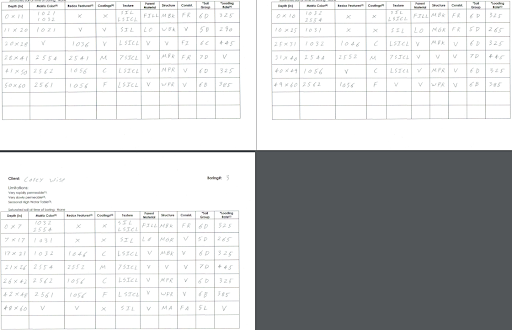
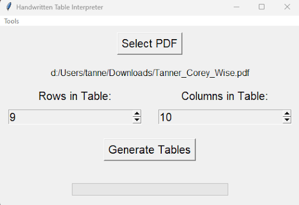
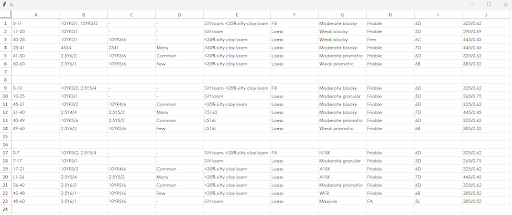

# Table_OCR
Converts handwritten tables of data into digital formats.

# User Guide

To run the application, run main_window.py

# Tools

There are a number of tools that can be accessed from the top left corner of the application. 
This section includes an overview of each tool.

## Default Directory

The default directory tool can be used to open file explorer in the same directory every time when clicking select PDF. 
This can be useful if PDFs being sent through the application are always located in the same directory.

## Edit Common Entry

It is important to let the application know about entries expected to be found in tables. That way, the program will not be
confused by characters that are often mixed up such as ‘1’ and ‘I’, ‘S’ and ‘5’, or ‘G’ and ‘6’. For example, if the program
makes a prediction that there is “GG” in a cell, but 6G is entered into common entries, the program will correct itself and put
“6G” instead of “GG” in the cell. Note that the program will not change anything if there are two or more possibilities for correction.
For example, if “S6” is predicted, but “SG” and “5G” are in the system, no modification will be made to the original prediction since there
is more than one option for correction.
 
## Edit Shorthand

Like the Edit Common Entry tool, entries entered into Edit Shorthand will be used by the application to correct confusion between ambiguous 
characters such as “1” and “I”, “5” and “S”, and “6” and “G”. Consequently, there is no need to enter something into Edit Common Entry if it is 
already in Edit Shorthand. The other functionality of Edit Shorthand is that the application will expand any patter on the left to whatever is placed 
on the right side. If there is a character or some entry that should be expanded everywhere even inside of words, then an asterisk should be put before 
it in the left hand column as is shown with “*X”.

## Ignore Rows

There may be some rows that should not be included in the table generation if there are typos or if there are headings that are not handwritten. It 
is not required that these rows be ignored, but it can speed up the conversion and make the generated table look cleaner.

## Train Model

When the model makes mistakes predicting what handwritten characters are in a cell, it is possible to conduct training to help it better understand an
individual's handwriting. Images are saved to the Train Model tool whenever a modification is made within a cell of the generated table and enter or tab
is pressed. Note that the image will only be saved if the modification has the same number of characters as the original prediction. This method is not
foolproof if an incorrect modification is entered by the user. Consequently, images must be approved before they are ready to be used for training.
If the label does not match the image, it should be rejected. Otherwise, it can be approved. Generally it is better to have a large number of approved images before
training is conducted. Twenty five or more approved images should bring the best results. The image above is an example of an image that should be approved. Below is an
example of an image that should be rejected. When training is ready to take place, press “Train”

## How to Generate a Table

The table above is used as an example. Note that the pages should be scanned so that the top is facing towards the left for the application to run properly. 
When handwriting the table, both pencil and pen can be used. If using a pencil, write somewhat darkly for best results. Characters might be missed if the handwriting 
is very light. Handwriting should be somewhat large and distinct. Characters should not be touching each other. Otherwise, they will likely be merged into one character 
during conversion. First the handwritten PDF that is desired to be converted to a digital table should be selected by clicking “Select PDF”. The PDF will be displayed below 
the button after the selection is complete. Some handy tools to notice is “V” to represent a downward error that can be written in a cell to copy whatever is in the cell 
above it. “V” can be written repeatedly to continuously copy an element downwards. Another feature is that two entries can be written in one cell. Make sure to write each 
entry on its own line so that they are written above or below each other within the cell.

After the PDF is selected and the correct number of rows and columns are selected (Currently, every table on each page must currently have the same number of rows and columns),
click “Generate Tables”. The progress bar at the bottom should start to fill up. Once complete, the generated table will be displayed.
 

At this point, corrections can be made. Enter shorthand and then pressing enter or tab will expand the entry and save the image for training if applicable. Multiple shorthand 
entries that are separated by commas will also be expanded. “V” can be entered into a cell to copy an entry from above into the cell containing “V”.

## Brief Note on How the Application Works

Central to the application is a machine learning model. Machine learning is an area of AI, and the model in this application functions by having a 32 by 32 pixel image input to 
make a prediction on what handwritten character is in the image. The process of locating each cell in the table and each letter in the cell is accomplished through digital image processing 
which is not AI. To observe how well handwritten characters are being located, it is possible to look at the processed images in Table_OCR/Storage/Processed after a table is generated. If images 
are not shown by default, hold control and roll the middle mouse wheel until images are displayed.

